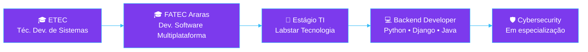
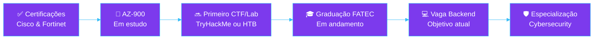

<div align="center">


<a href="https://linkedin.com/in/marcos-rodrigues-14391426b/"></a>
<a href="mailto:marcosrodrigues.code@gmail.com"></a>
<a href="https://github.com/marcos22-s"></a>


</div>

<br/>

## 👋 Quem Sou

- Desenvolvedor **Back-end em formação**, cursando **Desenvolvimento de Software Multiplataforma** na FATEC Araras
- Técnico em Desenvolvimento de Sistemas pela **ETEC Deputado Salim Sedeh**
- Baseado em **Leme, São Paulo — Brasil**
- Construo sistemas de ponta a ponta: da lógica de negócio no back-end à segurança da infraestrutura que a sustenta

## 💼 O Que Faço

**Estagiário de Suporte Técnico de TI** — Labstar Tecnologia *(2026 · atualmente)*
Atendimento técnico, infraestrutura de redes e segurança preventiva de acessos — a ponte prática entre meu interesse acadêmico em Cibersegurança e o dia a dia real de TI.

## 🧭 Minha Jornada



## 📚 O Que Estudo Agora


## 🧰 O Que Construo

<table>
<tr>
<td width="50%" valign="top">

**⚙️ Backend**


**🗄️ Banco de Dados**


**☁️ Cloud**


**🏗️ Arquitetura & Boas Práticas**
`REST API` `MVC` `Modelagem Relacional` `Modelagem NoSQL`

</td>
<td width="50%" valign="top">

**🎨 Frontend**


**🔧 DevOps**


**🛡️ Cybersecurity**
`TCP/IP` `Firewall` `SIEM` `MITRE ATT&CK` `Threat Intelligence`

**🧩 Ferramentas**


</td>
</tr>
</table>

## 🚀 Meus Projetos

<table>
<tr>
<td width="50%" valign="top">

### 🏗️ Projeto Constrular
*Sistema de gestão para loja de materiais de construção*

<!-- 📸 INSERIR AQUI: screenshot da tela de estoque/dashboard — 1280x720px, PNG ou WebP, comprimida (<300kb) -->

Centraliza estoque, cadastros e relatórios que antes eram controlados manualmente.

**Tecnologias**


**Funcionalidades**
`Controle de estoque` `Cadastro de funcionários e produtos`

**Resultado:** entregue como Projeto Integrador, apresentado e validado em banca acadêmica na FATEC Araras.

<p>
<a href="https://github.com/orgs/Constrular-Material-de-Construcao/projects/2/views/1"></a>

</p>

</td>
<td width="50%" valign="top">

### 🐾 Pet & Pet
*Sistema de gestão para pet shop*

<!-- 📸 INSERIR AQUI: screenshot da tela de agendamento — 1280x720px, PNG ou WebP, comprimida (<300kb) -->

Organiza agendamentos e prontuários de animais que antes eram controlados manualmente, com risco de erro.

**Tecnologias**


**Funcionalidades**
`Cadastro de clientes e animais` `Agendamento de banho e tosa`

**Resultado:** projeto de conclusão validado academicamente, com modelagem relacional completa.

<p>
<a href="https://github.com/marcos22-s/PI-2--Semestre-2025"></a>

</p>

</td>
</tr>
</table>

<div align="center">

<!-- 📸 INSERIR AQUI (opcional): GIF de 5-10s navegando pelo próximo projeto de Cybersecurity, 800px de largura, .gif ou .webp -->

**🚧 Em desenvolvimento:** write-up de CTF / Lab de Cibersegurança (TryHackMe ou HackTheBox)

</div>

## 📈 Em Números

<div align="center">

| 🚀 Projetos | 🏆 Certificações | 🧰 Tecnologias | 💻 Linguagens | 🗄️ Bancos de Dados | 🎯 Áreas de Foco |
|:---:|:---:|:---:|:---:|:---:|:---:|
| **2** | **4** | **18+** | **7** | **3** | **6** |

</div>

## 🏆 Minhas Certificações


-1e293b?style=flat-square&logo=microsoft&logoColor=0078D4)

## 🎯 Meu Objetivo



Curto prazo: minha primeira oportunidade efetiva em **Desenvolvimento Back-end**. Médio prazo: transicionar para uma atuação híbrida entre **Backend Development e Cybersecurity**.

> 🌱 Ainda sem contribuições open source públicas — aberto a começar, com interesse em ferramentas back-end em Python/Django e conteúdo educacional de Cibersegurança.

## 📊 GitHub Stats

<div align="center">


</div>

<details>
<summary><strong>🐍 Ativar Contribution Snake</strong></summary>
<br/>

Precisa de uma GitHub Action no repositório `marcos22-s/marcos22-s`. Crie `.github/workflows/snake.yml`:

```yaml
name: Generate Snake
on:
  schedule: [{cron: "0 0 * * *"}]
  workflow_dispatch:
jobs:
  generate:
    runs-on: ubuntu-latest
    steps:
      - uses: Platane/snk@v3
        with:
          github_user_name: marcos22-s
          outputs: dist/github-contribution-grid-snake-dark.svg?palette=github-dark
      - uses: crazy-max/ghaction-github-pages@v4
        with: {target_branch: output, build_dir: dist}
        env: {GITHUB_TOKEN: "${{ secrets.GITHUB_TOKEN }}"}
```

Depois: ``
</details>

---

<div align="center">

## 🤝 Vamos Construir Algo Juntos

Estou aberto a oportunidades de estágio e efetivação em **Desenvolvimento Back-end**.

<a href="https://linkedin.com/in/marcos-rodrigues-14391426b/"></a>
<a href="mailto:marcosrodrigues.code@gmail.com"></a>

<br/><br/>


</div>
