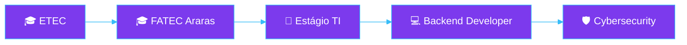
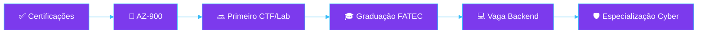

<div align="center">


<sub>
<a href="https://github.com/marcos22-s">GitHub</a> · <a href="https://linkedin.com/in/marcos-rodrigues-14391426b/">LinkedIn</a> · 
</sub>

</div>

<br/>

## 👋 Quem Sou

Desenvolvedor **Back-end em formação**, cursando Desenvolvimento de Software Multiplataforma na **FATEC Araras**
e técnico em Desenvolvimento de Sistemas pela **ETEC Deputado Salim Sedeh**. Baseado em Leme, São Paulo.

Construo sistemas de ponta a ponta — da lógica de negócio no back-end à segurança da infraestrutura que a sustenta.

## 💼 O Que Faço

**Estagiário de Suporte Técnico de TI** — Labstar Tecnologia · *2026, atualmente*
Atendimento técnico, infraestrutura de redes e segurança preventiva — a ponte entre meu interesse em Cibersegurança e o dia a dia real de TI.

## 🧭 Minha Jornada



## 📚 O Que Estudo Agora

Certificação **Microsoft AZ-900** (Azure Fundamentals) e meus primeiros labs práticos de Cibersegurança.

## 🧰 O Que Construo

**Backend**


**Frontend**


**Banco de Dados**


**Cloud & DevOps**


**Cybersecurity**
`TCP/IP` `Firewall` `SIEM` `MITRE ATT&CK` `Threat Intelligence`

**Arquitetura & Boas Práticas**
`REST API` `MVC` `Modelagem Relacional` `Modelagem NoSQL`

## 🚀 Meus Projetos

### 🏗️ Projeto Constrular
*Sistema de gestão para loja de materiais de construção*

<!-- 📸 INSERIR AQUI: screenshot da tela de estoque/dashboard — 1280x720px, PNG ou WebP, comprimida (<300kb) -->

Centraliza estoque, cadastros e relatórios que antes eram controlados manualmente — controle de estoque básico e cadastro de funcionários, usuários e produtos.


Entregue como Projeto Integrador, apresentado e validado em banca acadêmica na FATEC Araras.

**[→ Ver no GitHub](https://github.com/orgs/Constrular-Material-de-Construcao/projects/2/views/1)**

<br/>

### 🐾 Pet & Pet
*Sistema de gestão para pet shop*

<!-- 📸 INSERIR AQUI: screenshot da tela de agendamento — 1280x720px, PNG ou WebP, comprimida (<300kb) -->

Organiza agendamentos e prontuários de animais, antes controlados manualmente — cadastro de clientes e animais, agendamento de banho e tosa.


Projeto de conclusão validado academicamente, com modelagem relacional completa.

**[→ Ver no GitHub](https://github.com/marcos22-s/PI-2--Semestre-2025)**

<br/>

<!-- 📸 INSERIR AQUI (opcional): GIF de 5-10s navegando pelo próximo projeto de Cybersecurity, 800px de largura -->

🚧 *Em desenvolvimento: write-up de CTF / Lab de Cibersegurança (TryHackMe ou HackTheBox)*

## 📈 Em Números

<div align="center">

**2** Projetos &nbsp;·&nbsp; **4** Certificações &nbsp;·&nbsp; **18+** Tecnologias &nbsp;·&nbsp; **7** Linguagens &nbsp;·&nbsp; **3** Bancos de Dados

</div>

## 🏆 Minhas Certificações


-1e293b?style=flat-square&logo=microsoft&logoColor=0078D4)

## 🎯 Meu Objetivo



Curto prazo: minha primeira oportunidade efetiva em **Desenvolvimento Back-end**. Médio prazo: uma atuação híbrida entre Backend Development e Cybersecurity.

<sub>🌱 Ainda sem contribuições open source públicas — aberto a começar, com interesse em ferramentas back-end em Python/Django.</sub>

## 📊 GitHub Stats

<div align="center">


</div>

<details>
<summary><sub>🐍 Ativar Contribution Snake (configuração opcional)</sub></summary>
<br/>

Crie <code>.github/workflows/snake.yml</code> no repositório <code>marcos22-s/marcos22-s</code>:

```yaml
name: Generate Snake
on:
  schedule: [{cron: "0 0 * * *"}]
  workflow_dispatch:
jobs:
  generate:
    runs-on: ubuntu-latest
    steps:
      - uses: Platane/snk@v3
        with:
          github_user_name: marcos22-s
          outputs: dist/github-contribution-grid-snake-dark.svg?palette=github-dark
      - uses: crazy-max/ghaction-github-pages@v4
        with: {target_branch: output, build_dir: dist}
        env: {GITHUB_TOKEN: "${{ secrets.GITHUB_TOKEN }}"}
```
</details>

<br/>

<div align="center">

### 🤝 Vamos Construir Algo Juntos

Aberto a oportunidades de estágio e efetivação em **Desenvolvimento Back-end**.

<a href="https://linkedin.com/in/marcos-rodrigues-14391426b/"></a>

<sub><a href="mailto:marcosrodrigues.code@gmail.com">marcosrodrigues.code@gmail.com</a></sub>

<br/><br/>


</div>
